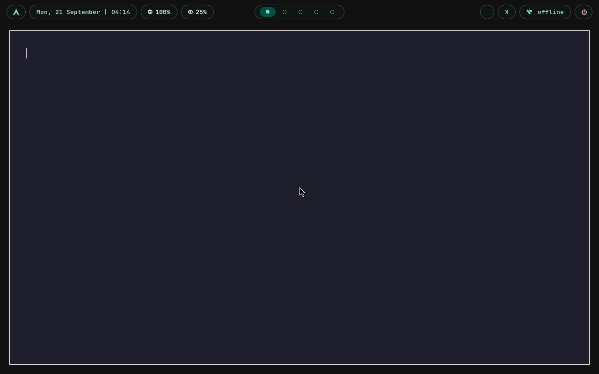
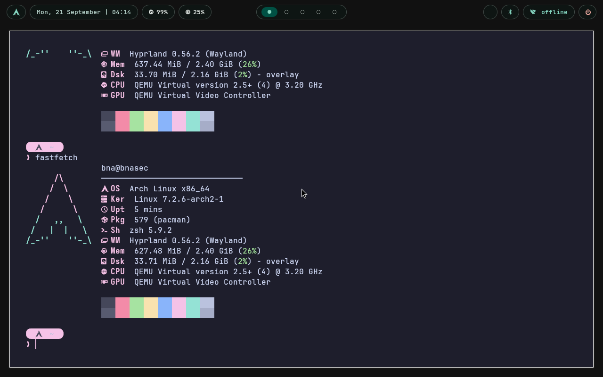
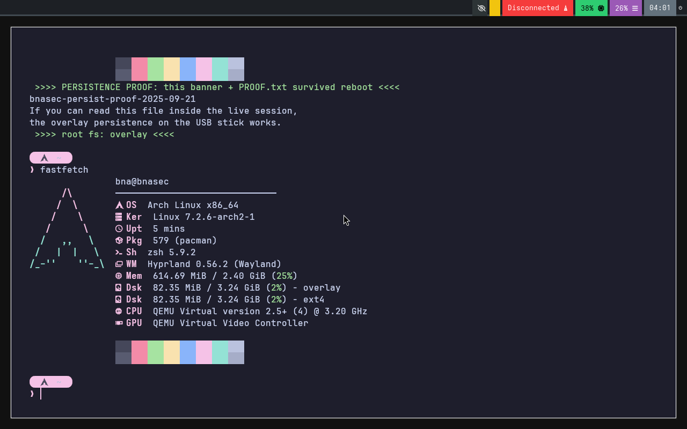

# bnasec Arch — Hyprland Persistent Live ISO

A customized **Arch Linux + Hyprland** live ISO based on [bnasec-os](https://github.com/f1999society-cmd/bnasec-os), fully riced with the [low-sepecs-hyprland-dotfiles](https://github.com/okyashgajjar/low-sepecs-hyprland-dotfiles) and rebuilt with **true USB persistence** — everything you change on the live system survives reboots.

  

## Download

Grab the latest ISO from the [**Releases**](https://github.com/f1999society-cmd/arch/releases) page:

**v1.1.1** is a **single file** (~1.7 GB, no split parts):

**Direct link:** [bnasec-arch-1.1.1-amd64.iso](https://github.com/f1999society-cmd/arch/releases/download/v1.1.1/bnasec-arch-1.1.1-amd64.iso)

Optional integrity check after downloading:

```bash
sha256sum bnasec-arch-1.1.1-amd64.iso
# expected: 6f315a4686d0ee245f6ee77bd50e9e5d1130d1f6cd378c74145178ff0726cd3d
```

## What's inside

- **Arch Linux** live system, kernel `7.2.6-arch2-1`
- **Hyprland 0.56.2** (Wayland) with the full low-specs rice: Catppuccin waybar (pill theme default, 15 themes via `Super+W`), fastfetch greeting, tuigreet greeter, user `bna` / password `bnasec`
- **Working sudo** — `bna` is in `wheel` with sudoers enabled, all setuid binaries intact
- **Automatic persistence**: on first boot the init scans the boot disk, appends a new partition, formats it `ext4` labelled `persistence` and mounts the whole root through an overlay — every file change (home, configs, installed packages) lands on the stick
- **Boot menu** (BIOS: isolinux / UEFI: systemd-boot):
  - `Arch Hyprland (Noro rice) — persistent` ← default
  - `Arch Hyprland — RAM-only session (no persistence)`
  - `verbose boot (debug)` — serial console enabled

## Screenshots (from QEMU verification runs)

**Desktop — pill waybar (Arch launcher · date/clock · cpu/mem · workspace pills · network · power):**



**fastfetch in kitty (auto-greeting):**



**Persistence proof — file injected into the persistence partition between two boots, printed by the live session after reboot (root fs = overlay):**



## Flash to USB

> A **4 GB+** stick is enough (the rest becomes your persistence partition).

**Linux / macOS (dd)**
```bash
# replace sdX with your USB stick — this wipes it!
sudo dd if=bnasec-arch-1.1.1-amd64.iso of=/dev/sdX bs=4M status=progress oflag=sync
```

**Windows (Rufus)**
1. Open Rufus → select the ISO
2. Partition scheme: **MBR**, target: **BIOS or UEFI** (both work)
3. Write in **DD mode** (important — not ISO mode)

**Ventoy** also works (the persistence partition is created automatically on the stick itself).

## Persistence — how it works

- On every boot the init looks for a partition labelled `persistence` on the boot device.
- If none exists (and the medium is a USB disk, or `bnasec.persist=force` is set — the default) it **appends a new partition** in the free space after the ISO data and formats it as ext4 labelled `persistence`.
- The root filesystem is mounted read-only from the ISO and combined with the persistence partition via **overlayfs**, so `/`, `/home`, `/etc`… are all writable and **stored on the stick**.
- A read-only view of the persistence store is also bind-mounted at `/run/bnasec/persist`.
- To reset to a fresh system: re-flash the ISO (or delete the `persistence` partition).
- To boot **without** persisting anything: pick `RAM-only session` in the boot menu.

Verified in QEMU on the BIOS path: boot → desktop login → file created on the persistence store → **reboot** → file + home state still there (`root fs: overlay`).

## Keybinds (defaults)

| Keys | Action |
|------|--------|
| `Super+Return` | kitty terminal |
| `Super+Space` | rofi launcher |
| `Super+W` | waybar theme selector (15 themes) |
| `Super+T` | Hyprland theme selector (glass/material/modern/noro/retro) |
| `Super+R` | random wallpaper |
| `Super+E` | thunar file manager |
| `Super+B` | firefox |
| `Super+Q` | close window |
| `Super+Shift+E` | exit Hyprland |

## Changelog

### v1.1.1
- Fixed: waybar default theme is now **pill** (v1.1.0 had a broken symlink → stock bar)
- Fixed: **setuid bits restored** — sudo/su/mount/… worked for `bna` now (v1.1.0 sudo was broken)
- Fixed: rofi theme symlinks
- Verified: BIOS boot, desktop, persistence-across-reboot (QEMU evidence in this repo)

### v1.1.0
- Initial customized build: dotfiles applied, persistence init (`bnasec.persist=force`), hybrid BIOS+UEFI

## Verifying the download

```bash
sha256sum -c bnasec-arch-1.1.1-amd64.iso.sha256
```

## Building / customizing

The ISO layout is a standard archiso-style tree (`airootfs.sfs` + initramfs with a custom `bnasec-init` hook). Drop into the live session, modify, and re-squash — or fork this repo and rebuild.
